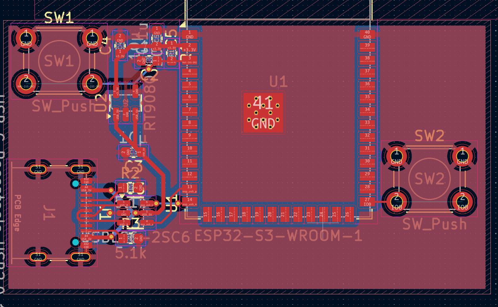

# CREATE Rocket ESP32 S3 template

> [!WARNING]
> Kicad v9を用いて作成したため、これ以下のバージョンのkicadだと動きません

ESP32 S3を動作させるのに必要な最低限のものだけ実装したプロジェクトです。

これを変更することで、より高度なものを作ることができます。

## 使用部品
| 部品名                     | 個数 | url                                                                              |
| -------------------------- | ---- | -------------------------------------------------------------------------------- |
| ESP32 S3 WROOM 1           | 1    | https://akizukidenshi.com/catalog/g/g117256/                                     |
| RT9080 3.3V レギュレーター | 1    | https://akizukidenshi.com/catalog/g/g129588/                                     |
| Type C 基板実装用          | 1    | https://akizukidenshi.com/catalog/g/g114356/                                     |  |
| USBLC6-25C6                | 1    | https://www.digikey.jp/ja/products/detail/stmicroelectronics/USBLC6-2SC6/1040559 |
| LM66100DCKR                | 1    | https://www.digikey.jp/ja/products/detail/texas-instruments/LM66100DCKR/10273183 |
| 1608 コンデンサ 0.1uF      | 2    | https://akizukidenshi.com/catalog/g/g113374/                                     |
| 1608 コンデンサ 10uF       | 2    | https://akizukidenshi.com/catalog/g/g113161/                                     |
| 1608 抵抗 10k              | 1    | https://akizukidenshi.com/catalog/g/g130355/                                     |
| 1608 抵抗 5.1k (4.7k)      | 2    | https://akizukidenshi.com/catalog/g/g130353/                                     |
| タクトスイッチ             | 2    | https://akizukidenshi.com/catalog/g/g103647/                                     |